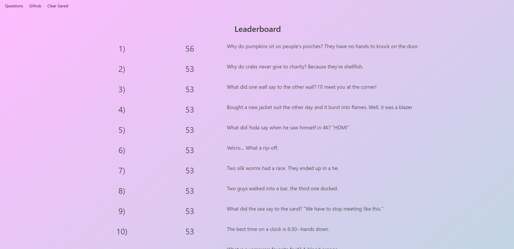

# Dad-vs-Mom-Jokes

## Links
Try our site [here](https://canadianbleach.github.io/dad-vs-mom-jokes/)

## Description
Motivation
- This project aims to create an engaging and fun game where players can participate in a showdown between dad jokes and yo momma jokes. The motivation behind this game is to provide entertainment, humor, and a platform for users to enjoy a lighthearted competition while determining the most popular type of jokes among players.

Purpose
- The purpose of this game is to offer players an interactive experience where they can read, vote on, and enjoy either dad jokes or yo momma jokes. By presenting these jokes in a playful setting, the game aims to bring laughter and amusement to its users while allowing them to engage in friendly competition to determine the preferred type of humor.

Problems
- The primary challenge addressed by this project is to create an intuitive and user-friendly interface that allows players to easily navigate between dad jokes and yo momma jokes, read the jokes, and vote for their favorite ones. Ensuring that the voting system accurately records and displays the most popular jokes based on user votes is another key challenge that this game resolves.

Learnings
- Throughout the development of this project, several key learnings emerged. Understanding user preferences and engagement patterns in humor-based applications was crucial in designing an enjoyable user experience. Implementing an efficient voting system and a clear leaderboard helped in showcasing the most popular jokes, providing insights into user preferences.

## Screenshot

